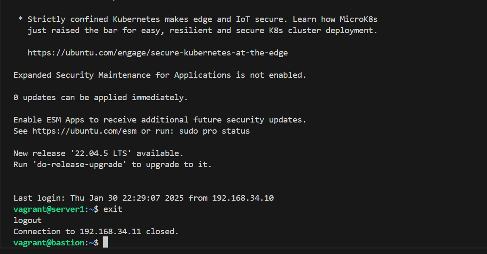
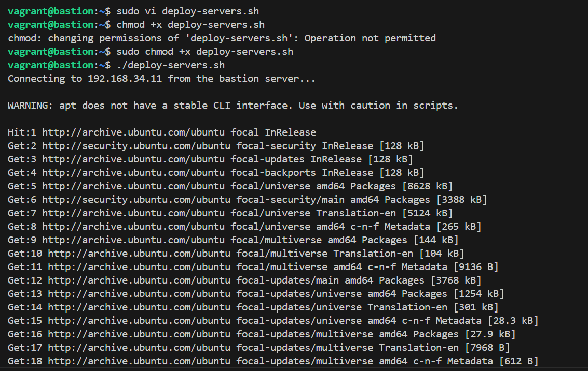
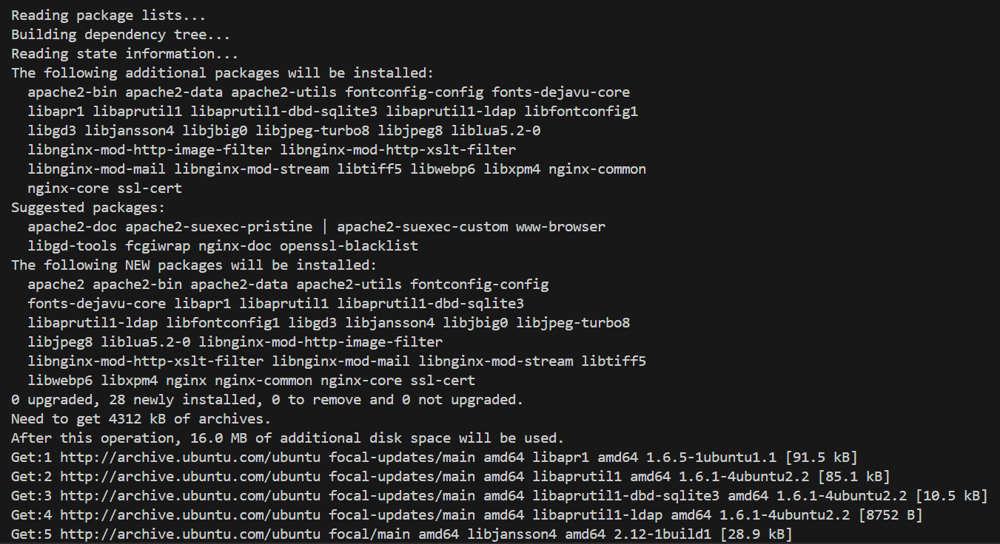
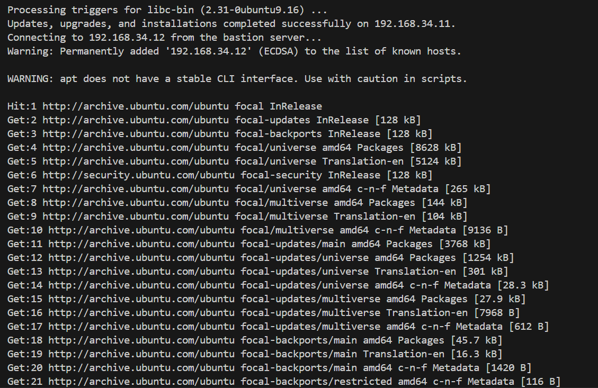

## Project 7 critical thinking

### Screenshot below shows ssh into server1 from the bastion server

### The screenshot below shows the deployment, connecting to server1 to begin the upgrades

### Below shows the updates done on server 1

### Below shows successful upgrade, updates and installations on server 1. And also the start to server2 task
